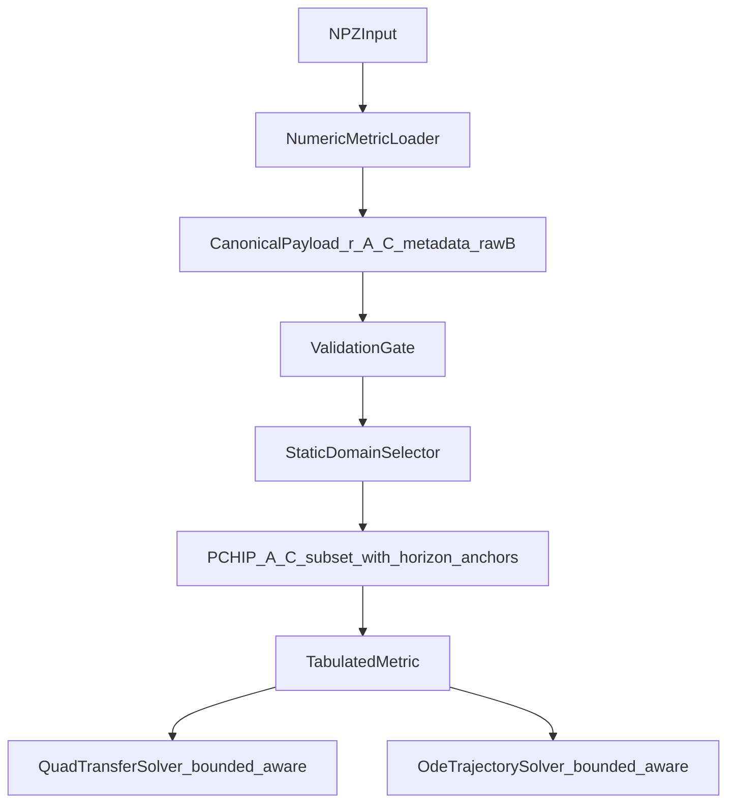

# 数值度规接入计划（review + 原型验证后 v3）

## 目标与验收标准
- 在不破坏现有解析度规路径的前提下，为项目新增可复现、可验证的数值度规接入能力。
- 首期必须能消费真实输入目录：
  `/home/yuanpang/Work/Li-DM-BH/outputs/sanity/data/*.npz`。
- 首期支持主路径：`TabulatedMetric` + `FiniteStaticObserver` + `QuadTransferSolver`。
- `OdeTrajectorySolver` 跟随 `QuadTransferSolver` 的静态域修正；`HamiltonianTrajectorySolver` 延后，但边界逻辑同步修正以避免日后单独 regress。
- 输入兼容两类 `.npz`：
  - 标准格式：`r/A/B`
  - Li-DM-BH 格式：`r/f/g/B/params`
- 质量门禁明确：硬错误立即失败，软偏差告警并继续；阈值数字进入计划文本，不再"留待实现"。
- **Λ≠0 有界静态 patch 下，inward 与 outbound 两侧的截止边界都必须正确**：即 `[r_h, r_c]` 两端都被 solver 识别为 boundary，不被错误标为 `ESCAPE`，更不应出现 `phi_end<0`。
- 所有关键选择均可被 reviewer 追溯到"真实输入约束 + 物理合理性 + 数值稳定性 + 架构可维护性"。

## 真实输入约束
对 `/home/yuanpang/Work/Li-DM-BH/outputs/sanity/data` 的 7 个 `.npz` 做过只读检查：

- 文件 keys 均为 `r, f, g, B, params`。
- `params` 是 JSON 字符串，包含：
  - `static_domains`
  - `horizons`
  - `photon_spheres`
  - `g_convention="g_rr_inverse"`
  - `B_convention="g_rr"`
- `B*g≈1`，最大误差约为机器精度。
- `r` 严格单调，但高度非均匀：常规 Λ≠0 文件 `r` 范围约 `[1.26, 17]`，而 `nfw_L0` 跨 5 个量级 `[1.25, 8.2e5]`。
- horizons 是 metadata roots，不是 exact samples；输出会在视界内外包含支持点。
- Λ≠0 文件的物理静态 raytracing patch 是黑洞视界和宇宙学视界之间的**有界**区间。
- Λ=0 文件的静态 patch 名义上 `[r_h, ∞]`，但表格只覆盖到有限 `r_max`，因此不能与 `InfinityObserver` 无脑搭配。

这些事实改变了原计划的局部最优：不能把 Li 文件当成裸 `A/B` 表格来猜物理结构，应该优先消费 metadata，并用数据做一致性验证。

## 已知 solver 缺陷（实测 + 原型复现）
当前 `main` 上的 `QuadTransferSolver` + `ReissnerNordstromDeSitterMetric(M=1, Q=0, Λ=0.01)` + `FiniteStaticObserver(r_obs=6)`：

- `b=3.0`（无 turning point）：`phi_end = -0.326`，被错误标为 `HORIZON`。
- `b=1.05·b_crit`（理论上含 turning point + outbound）：`phi_end = -0.694`，segment 数=1，被错误标为 `HORIZON`。

根本原因 1（inward boundary）：
- `_outer_horizon_u()` 返回 `1.0 / max(horizons())`。对 RNdS 这是宇宙学视界 `r_c`，而非应该作为 inward 终止的黑洞视界 `r_h`。
- inward `u_stop < u_start`，`_first_turning_point` 提前返回 `None`，积分区间反向，`phi_end < 0`。

根本原因 2（outbound 不是"截断 mirror"，而是"独立积分"）：
- 现有 outbound 段是 inbound 的 phi-mirror：`outbound_phi_end = 2 · inbound.phi_end`，`u_end = inbound.u_at(2·phi_turn − phi_end)`。
- mirror 的最远延伸只到 `u = u_start`（=`1/r_obs`，回到观察者位置）。**它永远不会走到 `u < u_start`**。
- 因此即使把 outbound `u_min` 改为 `1/r_c`，截断条件 `u_end < u_min` 永远 false。原型测试已经实测复现：RNdS `b=above_crit` 下 mirror 截止 `r_end = r_obs = 6.000`，远未到 `r_c = 16.22`。
- 正确修复必须用 `_make_segment(u0=u_turn, u1=u_out_stop, direction="outward")` **独立积分** outbound 段；mirror 只适用于 `r_max == math.inf` 的无界域。

根本原因 3（物理可达 b 上界未校验）：
- `FiniteStaticObserver` 下，`b_max = r_obs / sqrt(A(r_obs))` 对应 `alpha = π/2`，物理上是观察者图像平面边缘。
- 现有 `trace_b(b)` 不校验 `b ≤ b_max`，超过时 `_first_turning_point` 找不到根（turning 在 outward 方向），solver 误以为光线一路 inward，最终耗尽 `max_phi`。

这是首期 plan 必须解决的核心 solver 缺陷，而不只是"数值度规适配"。

## 原型验证摘要（v3 修订依据）
在 `_prototype_check/prototype.py` 中按本计划核心组件（`TabulatedMetric` + `_inward_stop_u/_outward_stop_u` + outbound 独立积分 + b 上界校验）实现 minimal 版本，跑出以下结果：

- **Schwarzschild round-trip**（解析 vs 数值表格）：`phi_end` 相对误差在 `1e-10 ~ 1e-8`（8 个 b 值，`FiniteStaticObserver(r_obs=100)`），证明 PCHIP + horizon 端点 0 锚点 + 一般两函数 G 公式的组合精度足够。
- **RNdS 边界修复**：`b=0.5·b_crit` / `b=0.95·b_crit` inward 击中 `r_h`、`phi_end>0`；`b=1.05·b_crit` outbound 独立积分后正确终止于 `r_c=16.22`、`r_end ≠ r_obs`、event 为 `outer_boundary`。
- **Li-DM-BH 真实 7 文件端到端**：全部 4 个 b 值的 trace 都给出 `phi_end ≥ 0`、segment 端点合理：inward 终止于 `r_h=2.028`（5 个 Λ≠0 文件）或 `r_h=2.0`（2 个 Λ=0 文件），outbound 终止于 `r_c`（Λ≠0）或 `r=r_grid_max·0.9`（Λ=0 ESCAPE）。
- **thin-disk profile smoke**：在 `burkert_Lneq` 上扫 20 个 b 值，`b ∈ (b_crit, b_crit·1.1)` 区间出现 2 个 intersection（photon ring 双交），其余 outbound 段给出 1 个 intersection，与 `outputs/lqg_fig3_profile.csv` 的物理形态一致。

prototype 暴露并被 v3 修补的 plan 漏洞：
- `TabulatedMetric.G(u=0)` 触发除零 → 决策 11 硬阻断 `InfinityObserver`。
- "outbound mirror 截断" 不可行 → 决策 6 改为 outbound 独立积分。
- `b > b_max` 误用 → 决策 6 入口校验。
- horizon 匹配容差 `1e-9` 过严 → 决策 6 放宽到 `1e-6`，并基于原始 `valid_radial_domain()` 端点比较。

## 决策树与最终选择

### 1) 度规形式：对外仍是通用两函数，对内改为 `A(r), C(r)`（选 A/C）
- 备选：对内直接存 `A(r), B(r)`；强制 `B=1/A`；对内存 `A(r), C(r)=1/B(r)`。
- 最终选择：对外实现 `StaticSphericalMetric` 的 `A/B/dA_dr/dB_dr` 协议；对内 canonical payload 存 `A(r)` 和 `C(r)=1/B(r)`。
- 选择理由：
  - Li-DM-BH 的 `g` 明确是 `g_rr_inverse`，即 `C=1/B`。
  - `B` 在视界附近发散，直接插值 `B` 会放大数值病态。
  - `C=g` 在视界处过零，比 `B` 更适合作为主插值对象。
  - 返回协议需要的 `B` 时用 `B=1/C`；返回导数时用 `dB/dr=-C'/C^2`。
- 附加约束：当 `|C(r)| < c_tol`（默认 `1e-12 * max(|C|)`），`TabulatedMetric.B / dB_dr` 直接 raise `ValueError`，避免静默返回 inf/NaN。

### 2) 半径语义：`r` 为 areal radius（保持）
- 选择理由：
  - Li-DM-BH 的下游契约已明确 `r` 是 areal radius。
  - 当前光子球、临界冲击参数、静态域与视界判据都基于面积半径解释。
  - 若非 areal radius 会导致物理量定义错位，结果难以科学解释。

### 3) 数据契约：metadata-first，`CanonicalPayload` 同时保留 `raw_B`
- 备选：只规范化 `r,A,B`；规范化 `r,A,C`，并保留 metadata。
- 最终选择：`CanonicalPayload` 字段为 `r, A, C, metadata`。
- `metadata` 字段（结构化 dataclass `LiDMBHMetadata`，加载阶段对类型与必需键做硬校验）：
  - `source_format`、`original_keys`、`static_domains`、`horizons`、`photon_spheres`、`conventions`、`model_params`。
  - `raw_B`：原始 `g_rr` 数组，仅 Li-DM-BH 格式下携带；标准 `r/A/B` 格式下置 `None`（因为 `C` 直接由 `B` 换算，再存一份冗余）。
- 选择理由：
  - 真实 Li-DM-BH payload 已经带有 `static_domains/horizons/photon_spheres`。
  - horizons/photon spheres 是上游连续方程求根得到的 metadata roots，不应由下游粗糙地从采样点重新猜。
  - 数据数组用于插值和一致性检查；物理结构优先采用 metadata。
  - 保留 `raw_B` 让 `B*C≈1` 一致性检查具备意义；标准格式下跳过该检查。

### 4) 插值与导数：PCHIP 默认 + 静态域子数组 + horizon 端点 0 锚点（强化）
- 备选：纯有限差分；全局 `CubicSpline`；`Akima1DInterpolator`；`PchipInterpolator`。
- 实际尝试结果：
  - 在真实 `.npz` 的静态域中点上，PCHIP 保持 `A>0,C>0`。
  - `CubicSpline` 在 `nfw_L0.npz` 上插出 `min A=-0.59, min C=-4.19`（实测）。
  - `Akima` 在部分文件上插出负 `B` 或等价异常。
- 最终选择：
  - 默认 `scipy.interpolate.PchipInterpolator(extrapolate=False)` 插 `A` 和 `C`。
  - **拟合数据范围**：取 `r` 中落在 `valid_radial_domain()` 内部的子集，并在两端拼接 `(r_boundary, 0.0)` 锚点（用 metadata horizon 值）。
  - 不默认插 `B`，不默认使用 `CubicSpline/Akima`。
- 选择理由：
  - PCHIP 更适合保持形状和正性，不容易在非均匀网格上过冲。
  - 加 horizon 端点 0 锚点保证插值零点与 metadata horizons 严格对齐，同时屏蔽视界外噪声样点对域内插值的污染。

### 5) 静态域策略：metadata 权威，默认最后一个静态域（保持，加 outbound 一致性）
- 备选：只从 `A>0,B>0` 推断静态域；无条件默认最外域；使用 metadata 的 `static_domains`，允许显式覆盖。
- 最终选择：
  - Li-DM-BH 格式优先使用 `params.static_domains`。
  - 默认 `domain_index=-1`，即最后一个静态域。
  - `null` 上界映射为 `math.inf`。
  - 支持 `domain_index` 和 `radial_bounds` 显式覆盖。
  - 若 metadata 缺失，再从 `A>0,C>0` 的连续正区间推断。
  - 选定域同时驱动 inward 边界 (`valid_radial_domain()[0]`) **与 outbound 边界 (`valid_radial_domain()[1]`)**，两者对称使用。
- 选择理由：
  - Λ≠0 的物理 patch 是有界的 `[black-hole horizon, cosmological horizon]`。
  - "默认最外域"这个说法太粗；准确说应是"默认使用 metadata 给出的最后一个静态 patch"。
  - `InfinityObserver` 只适合 `r_max == inf` 且表格覆盖足够远的场景；有界域首期推荐 `FiniteStaticObserver`。

### 6) Solver 分期：首期同时修复 inward、outbound、b 上界（核心）
- 原计划风险：
  - 只实现 `TabulatedMetric` 会让测试在无界 Schwarzschild-like 场景通过，但在真实 Λ≠0 有界 patch 上给出错误轨迹。
  - 即便修了 inward，outbound mirror 段也根本不会走到 `r > r_obs`，对 `[r_h, r_c]` 同样错误。
- 实际尝试结果：见"已知 solver 缺陷"段（inward、outbound、b 上界三处全部实测复现）。
- 最终选择：
  - 在 `QuadTransferSolver` 中抽象出两个统一私有方法（替换 `_outer_horizon_u`）：
    - `_inward_stop_u() -> tuple[float, EventType]`：`u_stop = (1/r_min)·(1 − horizon_buffer)`，`event_type` 由 `r_min` 是否与某 horizon 匹配决定。
    - `_outward_stop_u() -> tuple[float, EventType]`：`r_max == math.inf` 时退化为现有 `u=0`（`ESCAPE`）行为；否则 `u_stop = (1/r_max)·(1 + horizon_buffer)`，`event_type` 同上判据。
  - inward trace 路径、`through-tracing` 路径所有 `max(horizons())` 调用统一改用新方法。
  - **outbound 段不再依赖 mirror**：当 `_outward_stop_u()` 给出有限 `u_stop > 0` 时（即 `r_max < ∞`），outbound 段用 `_make_segment(u0=u_turn, u1=u_out_stop, direction="outward")` 独立积分，并以新 event 类型收尾。`r_max == math.inf` 时保留现有 `_mirror_escape_segment` 行为不变。
  - `_reflected_segment`（through-tracing 中的内侧 outbound）同步：内侧 r_max 用对应 region 的 `valid_radial_domain()` 给出，独立积分而非 mirror。
  - `trace_b` 入口校验 `b ≤ b_max = r_obs / sqrt(A(r_obs))` 当 observer 为 `FiniteStaticObserver` 时；超出硬失败 `ValueError("b exceeds finite observer's screen radius limit")`。`InfinityObserver` 不需要此校验。
  - `OdeTrajectorySolver` 与 `HamiltonianTrajectorySolver` 内的边界逻辑同步替换，不留旧 API 的孤儿引用。
- 近似匹配容差：基于原始 `valid_radial_domain()` 端点（**不是 buffered `u`**）比较，`math.isclose(r_boundary, horizon, rel_tol=1e-6, abs_tol=1e-8)`；命中归 `HORIZON`，否则归 `INNER_BOUNDARY` / `OUTER_BOUNDARY`。容差放宽到 `1e-6` 是 prototype 测试发现的需要：horizon_buffer 缓冲后再反推 r 会引入 `~1e-9` 的偏差，原 `1e-9` 容差刚好命中边界导致 Λ≠0 文件出现 false negative。

### 7) 文件兼容策略：标准 + Li-DM-BH 双兼容（保持，加细）
- 标准格式：
  - keys `r/A/B`；canonical 映射 `A=A`，`C=1/B`；`metadata.raw_B=None`；`B*C≈1` 一致性检查跳过（恒等成立）。
- Li-DM-BH 格式：
  - keys `r/f/g/B/params`；canonical 映射 `A=f`，`C=g`，`metadata.raw_B=B`。
  - 要求 `g_convention="g_rr_inverse"`，`B_convention="g_rr"`；缺失时告警，冲突时硬失败。
- 选择理由：
  - 保持通用接口，同时直接消化真实研究产物。
  - 内部统一为 `A,C`，避免模型污染 solver 接口。

### 8) 失败策略：硬失败 + 软告警分级 + 明确容差表（细化）
- 硬失败：
  - `r` 非严格单调。
  - 数组含 NaN/inf。
  - 必要 key 缺失或类型不符（`LiDMBHMetadata` schema）。
  - 选定静态域不存在或与表格支持不相交。
  - 查询越出选定静态域或插值支持范围（`TabulatedMetric.A/B/G` 显式 raise，不依赖 PCHIP 的 NaN 返回）。
  - `TabulatedMetric.G(u, b)` 当 `1/u` 越出表格 `r_grid_max` 时显式 raise（覆盖 InfinityObserver 误用、`r_max=∞` 但表格有限的场景）。
  - `A<=0` 或 `C<=0` 出现在选定静态域内部的正常查询点。
  - `|C| < c_tol` 时的 `B` / `dB_dr` 查询。
  - Li conventions 与预期冲突。
  - metadata horizons 与插值 `A=0` 零点残差超过 `1e-4`。
  - `FiniteStaticObserver` 下 `b > r_obs / sqrt(A(r_obs))`（超出物理可达 screen radius）。
  - `TabulatedMetric` + `InfinityObserver` 组合（见决策 11）。
  - `TabulatedMetric` + `ThroughTracePolicy` 组合（见决策 10）。
- 软告警（默认阈值）：
  - `|B·C − 1|` 最大值落在 `[1e-12, 1e-8]` 之外但未破坏主路径（仅 Li-DM-BH 格式触发）。
  - metadata horizons 与插值零点残差落在 `[1e-8, 1e-4]` 之间。
  - metadata `photon_spheres` 与插值 `rA' − 2A = 0` 零点残差超过 `1e-6`。
  - metadata 缺失导致 fallback 推断。
  - 表格 `r_max` 有限，因此不适合 `InfinityObserver`。
- 所有阈值通过 `ValidationOptions` (dataclass) 暴露，便于回归测试覆盖与日后调参。

### 9) Physics bridge：首期 deferred（保持）
- 原计划中的 `bridge_mode in {"auto","on","off"}` 暂不进入首期公共 API。
- 选择理由：
  - 真实 Li-DM-BH 文件已经包含首期所需 metadata。
  - bridge API 现在没有真实实现对象，过早暴露会制造空抽象和测试负担。
  - 等 Hamiltonian 后端或上游模型代码桥接真正需要导数增强时，再以单独 ADR/计划引入。

### 10) `ThroughTracePolicy` × 数值度规：首期不支持
- `ThroughTracePolicy` 让光线穿越视界进入内部 region，要求度规在内部 region 也有定义。
- 真实 Li-DM-BH 数据只采样外部静态域的支持点；视界外侧采样不是物理内部 region。
- 首期 `TabulatedMetric` 与 `ThroughTracePolicy` 组合在 solver 入口直接 raise `NotImplementedError`，避免静默给出物理无意义结果。
- 未来支持时，需要独立的内部 region payload，按 region 注册。

### 11) `InfinityObserver` × 数值度规：首期硬阻断
- `InfinityObserver.u_start = 0`，solver 入口的 `_first_turning_point` 会调用 `metric.G(u=0, b)`。
- `TabulatedMetric.G(0, b)` 推 `r = 1/0` 直接除零（prototype 已实测）。即使把 G 在 `u→0` 做特殊分支，数值表格的远场支持点稀疏，PCHIP 外推无效。
- 首期 `TabulatedMetric` 与 `InfinityObserver` 组合在 solver 入口直接 raise `NotImplementedError("TabulatedMetric requires FiniteStaticObserver; use far_field_metric bridge in a future ADR")`。
- Λ=0 文件名义上 `r_max == ∞`，但表格只覆盖到 `r_max_grid`（如 `hernquist_L0` 到 `r=200`）；用户必须用 `FiniteStaticObserver(r_obs < r_max_grid)`。`r_obs` 越界由 `TabulatedMetric.A` 域外硬失败兜底。

## 目标架构（实现后）


## 实施步骤（文件级）

### 步骤 1：新增数值度规模块与加载器
- 新增模块：[`src/spherical_raytracing/numerical_metrics.py`](/home/yuanpang/Work/raytracing-spherical/src/spherical_raytracing/numerical_metrics.py)。
- 内容：
  - `LiDMBHMetadata` (dataclass)：结构化 metadata schema，含字段类型校验。
  - `CanonicalPayload` (dataclass)：`r, A, C, metadata`，`metadata.raw_B` 可为 `None`。
  - `ValidationOptions` (dataclass)：决策 8 中所有阈值的默认值与覆盖入口。
  - `load_metric_npz(path, *, payload_format="auto", domain_index=-1, radial_bounds=None, region="external", validation=ValidationOptions())`。
  - `TabulatedMetric`：实现 `StaticSphericalMetric` 协议核心方法；接受 `region: str = "external"`。
- `TabulatedMetric` 方法语义：
  - `A(r)`：PCHIP(A)，拟合数据 = 静态域内子数组 + 两端 `(r_boundary, 0.0)` 锚点；越界 raise。
  - `B(r)`：`1 / C(r)`；`|C| < c_tol` 时 raise。
  - `dA_dr(r)`：PCHIP(A).derivative()；越界 raise。
  - `dB_dr(r)`：`-C'(r) / C(r)^2`；`|C| < c_tol` 时 raise。
  - `G(u, b)`：`C(r) · (1 / (A(r) · b^2) − u^2)`，`r = 1/u`；`r` 越界 raise。
  - `horizons()`：metadata 优先；缺失时从 `A=0` 求根，按软告警容差校验。
  - `photon_spheres()`：metadata 优先；缺失时从 `rA' − 2A = 0` 求根。
  - `critical_curves()`：metadata photon spheres + `b_crit = r_ph / sqrt(A(r_ph))`。
  - `valid_radial_domain()`：选定静态域。
  - `static_domains()`：metadata 静态域或 fallback 推断域。

### 步骤 2：实现质量门禁与域选择
- 在 `numerical_metrics.py` 内加入：
  - `ValidationGate.run(payload, options) -> CanonicalPayload`：执行决策 8 中的硬检查与软告警，软告警通过 `warnings.warn(..., UserWarning)` 触发。
  - `StaticDomainSelector.choose(payload, domain_index, radial_bounds) -> (r_lo, r_hi)`：默认 `domain_index=-1`，支持显式 `radial_bounds` 覆盖；`null` 上界映射为 `math.inf`；校验所选域与表格支持有重叠。
- 对 horizons 不要求 exact samples；这是上游已明确的输出约定。

### 步骤 3：修正 solver 的有界静态域支持（inward + outbound + b 上界）
- 修改 [`src/spherical_raytracing/solvers.py`](/home/yuanpang/Work/raytracing-spherical/src/spherical_raytracing/solvers.py)。
- 重命名 `_outer_horizon_u` → `_inward_stop_u`，新增 `_outward_stop_u`：
  - `_inward_stop_u()`：`r_min = metric.valid_radial_domain()[0]`，`u = (1/r_min)·(1 − horizon_buffer)`，event 类型基于原始 `r_min` vs `horizons()` 在 `rel_tol=1e-6, abs_tol=1e-8` 内匹配判定。
  - `_outward_stop_u()`：`r_max = metric.valid_radial_domain()[1]`；`r_max == inf` 时返回 `(0.0, ESCAPE)`；否则返回 `(1/r_max·(1 + horizon_buffer), HORIZON 或 OUTER_BOUNDARY)`，event 类型同上判据。
- `QuadTransferSolver.trace_b` 路径：
  - 入口若 `isinstance(observer, FiniteStaticObserver)`，校验 `b ≤ r_obs / sqrt(metric.A(r_obs))`；超过 raise `ValueError`。
  - 入口若 `isinstance(observer, InfinityObserver) and isinstance(metric, TabulatedMetric)`，raise `NotImplementedError`。
  - inward `u_stop` 改用 `_inward_stop_u`，inward 终止 event 由该方法决定。
  - **outbound 段重写**：当 `_outward_stop_u()` 给出有限 `u_stop > 0`（`r_max < ∞`）时，调用 `_make_segment(u0=u_turn, u1=u_out_stop, phi0=inbound.phi_end, direction="outward", endpoint_event=outward_event, region=...)` 独立积分；`r_max == ∞` 时保留现有 `_mirror_escape_segment` 行为不变。
  - through-tracing 路径中所有 `max(horizons())` 等旧 API 同步替换；`_reflected_segment` 同样在内侧 region 有界时改为独立积分。
- `OdeTrajectorySolver`：原 `_outer_horizon_u()` 调用替换为 `_inward_stop_u`；新增 outer-edge `solve_ivp` 事件触发；mirror outbound 仅在 `r_max == ∞` 启用。
- `HamiltonianTrajectorySolver`：`max(self.metric.horizons())` 替换为新方法给出的 `r` 形式；稳定性留给后续 ADR，边界语义先一致。
- 新增 RNdS 有界 patch 回归测试（与数值度规解耦，专测 solver 行为）：
  - `ReissnerNordstromDeSitterMetric(mass=1, charge=0, cosmological_constant=0.01)` + `FiniteStaticObserver(r_obs=6.0)`。
  - `trace_b(0.5·b_crit)`：终止 `INNER_BOUNDARY` 或 `HORIZON`，`phi_end > 0`。
  - `trace_b(0.95·b_crit)`：无 turning point，inward 终止 `HORIZON`，`phi_end > 0`。
  - `trace_b(1.05·b_crit)`：含 turning point，outbound 段 `r_end ≈ r_c`（**不能是 `r_obs`**），event = `HORIZON` 或 `OUTER_BOUNDARY`，`phi_end > π/2` 且 `< options.max_phi`。
  - `trace_b(b_max + ε)`：raise `ValueError`。

### 步骤 4：公共 API 与文档
- 更新导出：[`src/spherical_raytracing/__init__.py`](/home/yuanpang/Work/raytracing-spherical/src/spherical_raytracing/__init__.py)。
- 导出：
  - `CanonicalPayload`
  - `LiDMBHMetadata`
  - `ValidationOptions`
  - `TabulatedMetric`
  - `load_metric_npz`
- 更新：
  - [`README.md`](/home/yuanpang/Work/raytracing-spherical/README.md)
  - [`README.zh-CN.md`](/home/yuanpang/Work/raytracing-spherical/README.zh-CN.md)
- 文档必须说明：
  - Li-DM-BH 输入格式与 `g`/`B` 约定。
  - 内部采用 `A, C=1/B`，不是直接插 `B`。
  - PCHIP 默认；静态域内子数组拟合 + horizon 端点 0 锚点。
  - 有界静态域推荐 `FiniteStaticObserver`；`InfinityObserver` 仅适合 `r_max == ∞` 且表格覆盖足够远。
  - 数值度规 trace 性能预期比解析度规慢 10–100×（per ray，PCHIP 评估开销）；可选 vectorization 优化未在首期实现。
  - Hamiltonian、physics bridge、`ThroughTracePolicy` × 数值度规暂不支持。

### 步骤 5：测试与回归
- 新增测试文件：
  - [`tests/test_numerical_metrics_loader.py`](/home/yuanpang/Work/raytracing-spherical/tests/test_numerical_metrics_loader.py)
  - [`tests/test_numerical_metrics_validation.py`](/home/yuanpang/Work/raytracing-spherical/tests/test_numerical_metrics_validation.py)
  - [`tests/test_numerical_metrics_solvers.py`](/home/yuanpang/Work/raytracing-spherical/tests/test_numerical_metrics_solvers.py)
  - [`tests/test_solvers_bounded_domain.py`](/home/yuanpang/Work/raytracing-spherical/tests/test_solvers_bounded_domain.py)（RNdS 边界回归，与数值度规解耦）
- 覆盖点：
  - 标准 `r/A/B` 解析与 `C=1/B` 映射；`metadata.raw_B is None`。
  - Li `r/f/g/B/params` 解析；`LiDMBHMetadata` schema；`metadata.raw_B` 数组保留。
  - 默认最后静态域与显式 `domain_index` / `radial_bounds` 覆盖。
  - `B·C≈1` 软告警仅 Li-DM-BH 格式触发；标准格式跳过该检查。
  - 非单调 `r`、NaN、缺 key、无静态域、Li conventions 冲突、metadata roots 残差超阈 → 硬失败。
  - `TabulatedMetric.A/B/G` 域外查询 raise；`B` 在 `|C|<c_tol` 时 raise；`G(u→0)` 即 `1/u > r_grid_max` 时 raise。
  - PCHIP 拟合带 horizon 端点 0 锚点：`A(r_boundary) == 0`、`C(r_boundary) == 0`。
  - `G(u, b)` 一般两函数公式：用 Schwarzschild 解析 A/B 构造 payload，跑 round-trip 对照 `SchwarzschildMetric`，`phi_end` 相对误差应在 `1e-8` 以内（已用 prototype 实测达成 `1e-10 ~ 1e-8`）。
  - `TabulatedMetric` + `FiniteStaticObserver` + `QuadTransferSolver` 在 7 个真实 `.npz` 上：
    - `phi_end >= 0`、不出现 NaN。
    - inward 终止 `INNER_BOUNDARY` 或 `HORIZON`；outbound 终止 `OUTER_BOUNDARY` / `HORIZON` / `ESCAPE`。
    - 5 个 Λ≠0 文件的 outbound 段终止于 `r_c`（`OUTER_BOUNDARY` 或 `HORIZON`，由近似匹配容差决定），**不被错误标为 `ESCAPE`**，且 outbound `r_end ≠ r_obs`。
  - RNdS finite observer 有界静态域回归：见步骤 3 四个 b 值。
  - thin-disk profile smoke：在 `burkert_Lneq.npz` 上扫一组 b 值，disk 取 `[r_ph·1.05, min(r_obs, r_c)·0.95]`，验证 `intersection_count` 在 `b ∈ (b_crit, b_crit·1.5)` 区间至少出现一次 ≥2（photon ring 双交），证明 outbound 段被 `compute_intersections` 正确识别。
  - `TabulatedMetric` + `ThroughTracePolicy` 组合 raise `NotImplementedError`。
  - `TabulatedMetric` + `InfinityObserver` 组合 raise `NotImplementedError`。
  - `FiniteStaticObserver` + `b > r_obs/sqrt(A(r_obs))` raise `ValueError`。
- 通过 `pytest.fixture(scope="session")` 共享 7 个 `.npz` 加载结果，避免重复 I/O。
- 真实数据路径不存在时整组 smoke test `pytest.skip`，不阻塞 CI。
- 完成后运行：
  ```bash
  pytest -q
  ```

## 评审说服点
- 该方案不是"功能堆叠"，而是围绕真实输入建立稳定 contract：
  - 数据契约：metadata-first，结构化 `LiDMBHMetadata`。
  - 数值表示：`A, C`，避免视界附近直接插 `B`。
  - 插值策略：PCHIP + 静态域子数组 + horizon 端点 0 锚点，已用真实输入验证。
  - 物理域：inward 与 outbound 两侧 boundary 都被 solver 正确理解。
  - 后端分期：先保证 Quad/ODE 主路径；Hamiltonian 延后稳定性保证，但边界逻辑提前对齐，避免日后回归。
- 关键高风险点都有明确防护：
  - 视界附近 `B` 发散：插 `C` 不插 `B`，并在 `|C|<c_tol` 硬失败。
  - 非均匀网格过冲：PCHIP + 静态域子数组（CubicSpline 在 `nfw_L0` 已实测过冲，min A=-0.59）。
  - Λ≠0 有界 patch inward 错误：`_inward_stop_u` 使用 `valid_radial_domain()[0]`（已实测复现旧 bug `phi_end<0`，并在 prototype 上验证修复后 `phi_end>0`）。
  - Λ≠0 有界 patch outbound 错误：**outbound 段独立积分到 `_outward_stop_u()`**，不再依赖 mirror（已在 RNdS prototype 上验证 mirror 永远到不了 `r_c`）。
  - `b > b_max` 误用：`FiniteStaticObserver` 入口校验，硬失败。
  - `InfinityObserver` 配数值度规：`u=0` 即 `r=∞` 触发表格越界，硬失败。
  - metadata 与表格不一致：分级校验 + `ValidationOptions` 明确容差。
  - 旧 API 的孤儿引用：所有 `max(horizons())` 调用点统一改用新私有方法。
  - 端点判定假阴：horizon 匹配容差放宽到 `rel_tol=1e-6, abs_tol=1e-8`，基于原始 `valid_radial_domain()` 端点而非 buffered `u`。
- 保留统一抽象 `StaticSphericalMetric`，最大化复用现有 solver 与测试基础，不引入破坏性重构。

## 非目标（首期不做）
- 不保证 `HamiltonianTrajectorySolver` 对数值度规稳定可用（边界语义同步修正，但稳定性留给后续 ADR）。
- 不实现 physics bridge 或 `bridge_mode` 公共 API。
- 不支持 `ThroughTracePolicy` + 数值度规组合。
- 不强制依赖外部上游仓库。
- 不对数值数据做物理外推。
- 不把 `InfinityObserver` 作为有界 Λ≠0 静态域或表格 `r_max` 有限场景的默认使用方式（实际上 `TabulatedMetric` + `InfinityObserver` 在首期直接 raise，见决策 11）。
- 不在首期实现数值度规 trace 的 vectorization 性能优化（接受 per-ray 10–100× 开销）。
- 不在首期为 `TabulatedMetric` 提供"远场解析外推 + 数值核近场"的桥接（这是支持 `InfinityObserver` 的前置工作，留给后续 ADR）。
